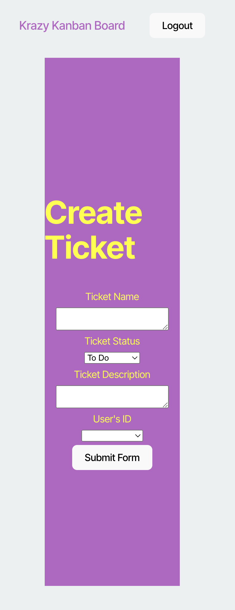

# Secure Kanban Board

## Description

This simple Kanban board was built to demonstrate authentication using JSON Web Tokens (JWT). Upon successful login, users are authenticated with a JWT, which is temporarily stored in local storage for subsequent authentication requests. Developed as part of the Module 14 Challenge for the Rutgers University Coding Bootcamp, this application serves as a practical tool for managing tasks—-organizing them into categories such as "Todo", "In Progress", and "Done." The authentication feature adds an extra layer of security, ensuring user data remains protected. Through this project, I gained valuable experience in connecting a database to Render and integrating it with my deployed application. Additionally, I worked on both the front-end and back-end of a full-stack application, strengthening my development skills and enhancing my marketability for future job opportunities.

## Table of Contents

- [Link to Application](#link-to-application)
- [Installation](#installation)
- [Usage](#usage)
- [Credits](#credits)
- [License](#license)
- [Questions](#questions)

## Link

https://secure-kanban.onrender.com/

## Installation

No installation is required to use this application. Follow the link above to go to the page.

To install the application on your local device for testing or viewing the repo, perform the following steps.

1. In the terminal, navigate to where you would like the repo to be stored on your device.

2. Clone the repo to your device using the following:

   ```sh
   git clone https://github.com/amelia1105/secure-kanban.git
   ```

3. Switch into the secure-kanban directory.

   ```sh
   cd secure-kanban
   ```

4. An .env.example file has been created in the server folder to allow users to connect to their own database. Remove the '.EXAMPLE' from the end of this file name, and enter your database username and password here. Create a JWT secret key; this can be any string.

5. Use the schema.sql in server > db to create a kanban_db database in your preferred PostgreSQL application.

   

6. In the command line, install dependencies using the following (be sure that you are in the correct directory):

   ```sh
   npm i
   ```

## Usage

To use this application in the web browser, follow the link above.

1. The link will take you to the home page. Click "Login" at the top right to log in.

   

2. Use this example profile to log in:

   username: JollyGuru
   password: password

3. If successful, you should see this:

   

4. Edit or delete items on lists by clicking the "Edit" or "Delete" buttons. Here, I've moved a ticket from "Todo" to "In Progress":

   

5. To create a new ticket, click "New Ticket". Fill out the necessary information and select a user to assign the task to, then hit "Submit".

   

6. When you are done, hit "Logout" at the top.

If you have installed the repo on your local device, perform the following steps to start the program on your local host:

1. After completing the installation steps, seed the database using the following code. Be sure that you are in the secure-kanban directory.

   ```sh
   npm run seed
   ```

2. Build the program:

   ```sh
   npm run build
   ```

3. Start the program:

   ```sh
   npm run start
   ```

4. You should see that the application is running on port 3001. Use Insomnia or Chrome to load http://localhost:3001. There, you can test POST requests or log in as a user from your own database.

## Credits

Starter code was sourced from Rutgers University Coding Bootcamp section RUT-VIRT-FSF-PT-10-2024-U-LOLC-MWTH > Assignments > Module 14 Challenge > [starter code](https://bootcampspot.instructure.com/courses/6369/assignments/90357?module_item_id=1341406). The starter code contains a completed, working (supposedly) full-stack application without authentication. I added an .env file, completed the authenticateToken method, the login method in auth-routes.ts, the API routes in index.ts, the login method in authAPI.tsx, and the AuthService methods. I used code from 25-Ins_JWT-Authentication-Review to get started on these methods (in Gitlab, [RUT-VIRT-FSF-PT-10-2024-U-LOLC](https://git.bootcampcontent.com/Rutgers-University/RUT-VIRT-FSF-PT-10-2024-U-LOLC) > 14-Full-Stack-React > 01-Activities > 25-Ins_JWT-Authentication-Review). I used GitHub Copilot and ChatGPT for debugging.

## License

MIT License

Copyright (c) 2025 Amelia Alvarado

Permission is hereby granted, free of charge, to any person obtaining a copy
of this software and associated documentation files (the "Software"), to deal
in the Software without restriction, including without limitation the rights
to use, copy, modify, merge, publish, distribute, sublicense, and/or sell
copies of the Software, and to permit persons to whom the Software is
furnished to do so, subject to the following conditions:

The above copyright notice and this permission notice shall be included in all
copies or substantial portions of the Software.

THE SOFTWARE IS PROVIDED "AS IS", WITHOUT WARRANTY OF ANY KIND, EXPRESS OR
IMPLIED, INCLUDING BUT NOT LIMITED TO THE WARRANTIES OF MERCHANTABILITY,
FITNESS FOR A PARTICULAR PURPOSE AND NONINFRINGEMENT. IN NO EVENT SHALL THE
AUTHORS OR COPYRIGHT HOLDERS BE LIABLE FOR ANY CLAIM, DAMAGES OR OTHER
LIABILITY, WHETHER IN AN ACTION OF CONTRACT, TORT OR OTHERWISE, ARISING FROM,
OUT OF OR IN CONNECTION WITH THE SOFTWARE OR THE USE OR OTHER DEALINGS IN THE
SOFTWARE.

## Questions

For any questions about this project, please contact me by email: aebellanger@yahoo.com
